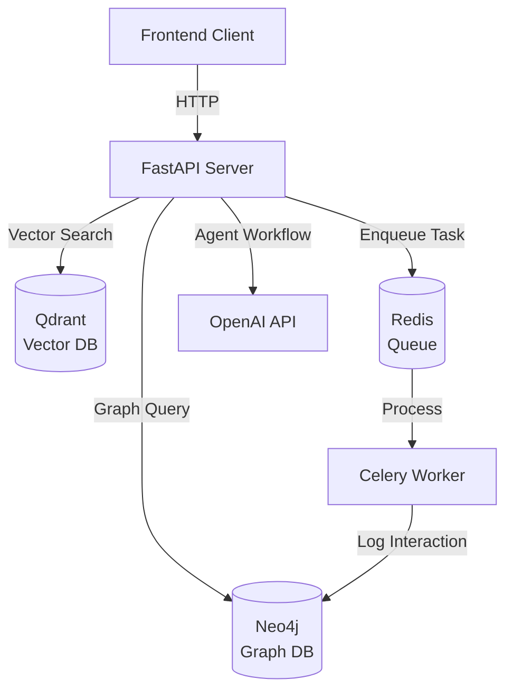
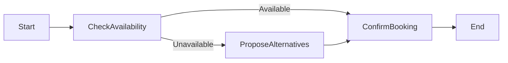

# Backend Architecture

## System Overview

The backend is built on **FastAPI** and implements a hybrid recommendation system combining:
1. **Vector Search** for semantic similarity
2. **Graph Analysis** for social proof
3. **Async Processing** for scalability
4. **Agentic Workflows** for intelligent booking



## Core Components

### 1. FastAPI Application (`app/main.py`)

**Responsibilities:**
- HTTP endpoint routing
- Request validation (Pydantic models)
- Response formatting
- Error handling

**Key Endpoints:**

#### `GET /feed`
**Purpose**: Generate personalized venue recommendations

**Algorithm:**
```python
1. Get user's preference vector (mock embedding)
2. Search Qdrant for similar venues (vector similarity)
3. Query Neo4j for social proof (friends' activity)
4. Merge scores: Final = (Vector × 0.7) + (Social × 0.3)
5. Sort by final score, return top 20
```

**Parameters:**
- `user_id`: User identifier
- `lat`, `lon`: User's location for geo-filtering

**Response:**
```json
{
  "feed": [
    {
      "venue_id": "venue_42",
      "name": "Jazz Lounge",
      "match_score": 0.85,
      "friend_activity": "3 friends going, 2 mutuals interested",
      "vibe_match": 0.9,
      "social_score": 15
    }
  ]
}
```

#### `POST /ingest/interaction`
**Purpose**: Log user interactions with venues

**Flow:**
```
1. Validate request (user_id, venue_id, type)
2. Enqueue Celery task (async processing)
3. Return immediately (non-blocking)
4. Worker processes task → writes to Neo4j
```

**Interaction Types:**
- `viewed`: User saw the venue (weight: 0.2)
- `saved`: User bookmarked it (weight: 1.0)
- `going`: User committed to visit (weight: 1.5)

#### `POST /social/connect`
**Purpose**: Create bidirectional friendship

**Neo4j Cypher:**
```cypher
MERGE (a:User {id: $user_id_a})
MERGE (b:User {id: $user_id_b})
MERGE (a)-[:FRIENDS_WITH]->(b)
```

#### `POST /agent/action`
**Purpose**: Agentic booking workflow

**LangGraph Workflow:**
```
1. Check Availability → 2. Propose Alternatives → 3. Confirm Booking
```

Uses OpenAI GPT-4 to handle natural language booking requests.

---

### 2. Vector Search (`app/vector.py`)

**Technology**: Qdrant (vector database)

**Data Model:**
```python
{
  "id": 42,  # Integer point ID
  "vector": [0.1, 0.2, ...],  # 1536-dim embedding
  "payload": {
    "venue_id": "venue_42",
    "name": "Jazz Lounge",
    "category": "bar",
    "location": {"lat": 40.7128, "lon": -74.0060}
  }
}
```

**Key Functions:**

#### `search_venues(vector, lat, lon, limit=20)`
**Purpose**: Find venues similar to user's taste, within geographic bounds

**Implementation:**
```python
client.query_points(
    collection_name="venues",
    query=vector,
    query_filter=models.Filter(
        must=[
            models.FieldCondition(
                key="location.lat",
                range=models.Range(gte=lat-0.1, lte=lat+0.1)
            ),
            # Similar for lon
        ]
    ),
    limit=limit
)
```

**Returns**: List of `{venue_id, score, payload}`

---

### 3. Graph Analysis (`app/graph.py`)

**Technology**: Neo4j (graph database)

**Data Model:**
```cypher
(:User {id, name, interests: []})-[:FRIENDS_WITH]->(:User)
(:User)-[:INTERESTED_IN {type, weight}]->(:Venue {id})
```

**Key Functions:**

#### `get_social_scores(venue_ids, user_id)`
**Purpose**: Calculate social proof for each venue

**Cypher Query:**
```cypher
UNWIND $venue_ids AS venue_id
MATCH (u:User {id: $user_id})
MATCH (v:Venue {id: venue_id})

// Direct friends
OPTIONAL MATCH (u)-[:FRIENDS_WITH]-(friend)-[r:INTERESTED_IN]->(v)
WITH venue_id, collect(DISTINCT {name: friend.name, type: r.type}) as friends_activity

// Mutual friends (2nd degree)
OPTIONAL MATCH (u)-[:FRIENDS_WITH]-(friend)-[:FRIENDS_WITH]-(mutual)-[r2:INTERESTED_IN]->(v)
WHERE NOT (u)-[:FRIENDS_WITH]-(mutual) AND mutual.id <> u.id
WITH venue_id, friends_activity, collect(DISTINCT mutual.id) as mutual_ids

RETURN venue_id, friends_activity, mutual_ids
```

**Scoring Logic:**
```python
score = 0
for friend in friends_activity:
    if friend.type == 'going': score += 10
    elif friend.type == 'saved': score += 5
    else: score += 3

score += len(mutual_ids) * 2  # Each mutual adds 2 points
```

**Returns**: `{venue_id: {social_score, friend_activity}}`

---

### 4. Async Processing (`app/worker.py`)

**Technology**: Celery + Redis

**Purpose**: Decouple interaction logging from API response time

**Task Definition:**
```python
@celery_app.task
def process_interaction(user_id, venue_id, interaction_type, weight):
    log_interaction_to_graph(user_id, venue_id, interaction_type, weight)
```

**Benefits:**
- **Non-blocking**: API returns immediately
- **Scalable**: Multiple workers can process tasks in parallel
- **Reliable**: Redis queue ensures tasks aren't lost

---

### 5. Agentic Booking (`app/agent.py`)

**Technology**: LangGraph + OpenAI

**Workflow:**


**State:**
```python
{
    "user_request": "Book a table for 4 at 7pm",
    "venue_id": "venue_42",
    "availability": True/False,
    "alternatives": [...],
    "confirmation": {...}
}
```

**LLM Prompts:**
- **Check Availability**: "Is this venue available for [request]?"
- **Propose Alternatives**: "Suggest similar venues if unavailable"
- **Confirm**: "Generate booking confirmation message"

---

## Data Flow

### Recommendation Generation
```
1. User requests feed
2. API fetches user vector (mock)
3. Qdrant searches for similar venues
4. Neo4j calculates social scores
5. API merges and ranks results
6. Response sent to client
```

### Interaction Logging
```
1. User clicks "Going" on venue
2. API validates request
3. Celery task enqueued to Redis
4. API returns success immediately
5. Worker picks up task
6. Worker writes to Neo4j
7. Future feed queries reflect this interaction
```

## Scalability Considerations

### Current Bottlenecks
1. **Neo4j Graph Queries**: Complex traversals can be slow
2. **Qdrant Vector Search**: Limited by single-node deployment
3. **Synchronous Feed Generation**: Blocks on Neo4j query

### Future Optimizations

#### 1. Caching
```python
# Redis cache for social scores
@cache(ttl=300)  # 5 minutes
def get_social_scores(venue_ids, user_id):
    ...
```

#### 2. Denormalization
Store pre-computed social scores in Qdrant payload:
```python
{
  "venue_id": "venue_42",
  "social_score_cache": 15,  # Updated periodically
  "last_updated": "2025-11-22T00:00:00Z"
}
```

#### 3. Read Replicas
- Neo4j read replicas for graph queries
- Qdrant sharding for vector search

#### 4. Async Feed Generation
```python
@app.get("/feed")
async def get_feed(...):
    vector_task = asyncio.create_task(search_venues(...))
    social_task = asyncio.create_task(get_social_scores(...))
    
    candidates = await vector_task
    social_scores = await social_task
    
    return merge_and_rank(candidates, social_scores)
```

## Security Considerations

### Current State (MVP)
- **No authentication**: Open endpoints
- **No rate limiting**: Vulnerable to abuse
- **No input sanitization**: Trusts all inputs

### Production Requirements
1. **JWT Authentication**: Verify user identity
2. **Rate Limiting**: Prevent DoS attacks
3. **Input Validation**: Sanitize all user inputs
4. **HTTPS**: Encrypt data in transit
5. **Database Credentials**: Use secrets management (Vault, AWS Secrets Manager)

## Monitoring & Observability

### Recommended Tools
- **Logging**: Structured logs (JSON) to ELK stack
- **Metrics**: Prometheus + Grafana
- **Tracing**: OpenTelemetry for distributed tracing
- **Alerts**: PagerDuty for critical failures

### Key Metrics
- **API Latency**: p50, p95, p99 response times
- **Error Rate**: 4xx, 5xx responses
- **Queue Depth**: Celery task backlog
- **Database Performance**: Query execution time

## Testing Strategy

### Unit Tests
- Test individual functions (e.g., `get_social_scores`)
- Mock external dependencies (Qdrant, Neo4j)

### Integration Tests
- Test API endpoints end-to-end
- Use test databases (Docker containers)

### Load Tests
- Simulate 1000 concurrent users
- Measure throughput and latency

## Deployment

### Docker Compose (Current)
```yaml
services:
  api: FastAPI server
  worker: Celery worker
  redis: Task queue
  qdrant: Vector DB
  neo4j: Graph DB
```

### Production (Future)
- **Kubernetes**: Orchestrate containers
- **AWS ECS/EKS**: Managed container service
- **Managed Databases**: RDS (Neo4j), Pinecone (vectors)
- **CDN**: CloudFront for static assets
- **Load Balancer**: ALB for API traffic

## Conclusion

This architecture balances **simplicity** (for MVP) with **extensibility** (for future scale). The hybrid vector + graph approach provides both personalization and social context, creating a compelling user experience.
