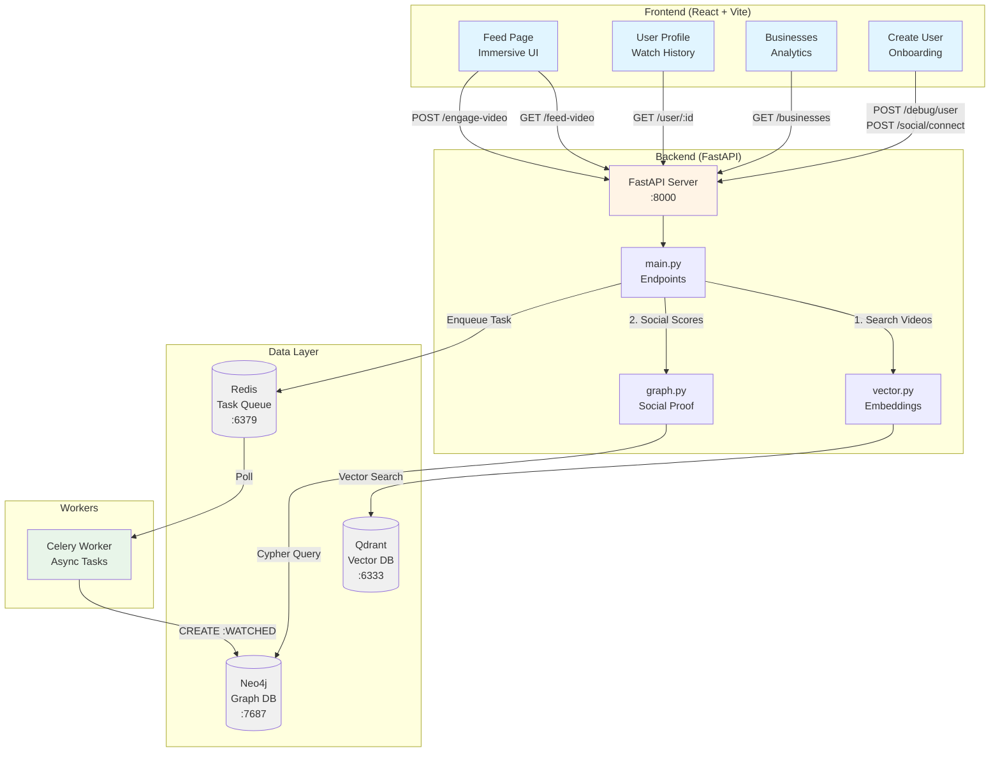
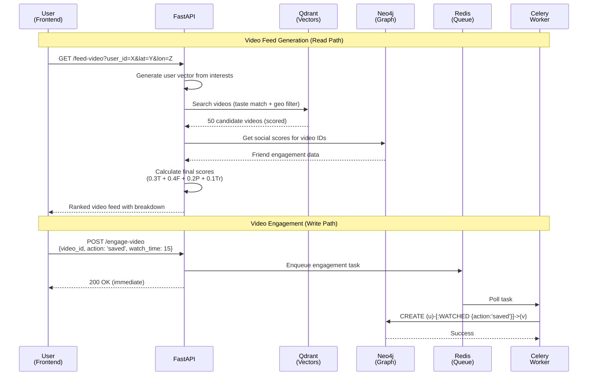

# GeoSocial Architecture

## System Overview

GeoSocial is a **video-first local business discovery platform** built on **FastAPI** that implements a hybrid recommendation system combining:
1. **Vector Search** for semantic similarity (taste matching)
2. **Graph Analysis** for social proof (friend activity)
3. **Async Processing** for scalability (engagement logging)
4. **Location-Based Filtering** for proximity ranking

### System Architecture Diagram



### Data Flow Diagram



### Data Model Diagram

```mermaid
graph LR
    subgraph "Neo4j Graph Database"
        User1[User<br/>id, name, interests]
        User2[User]
        User3[User]

        Video1[Video<br/>id, title, venue_id]
        Video2[Video]
        Video3[Video]

        Venue1[Venue<br/>id, name, category,<br/>neighborhood]
        Venue2[Venue]

        User1 -.->|FRIENDS_WITH| User2
        User2 -.->|FRIENDS_WITH| User3
        User1 -.->|FRIENDS_WITH| User3

        User1 -->|WATCHED<br/>{action, watch_time,<br/>timestamp}| Video1
        User2 -->|WATCHED<br/>{action:'saved'}| Video1
        User3 -->|WATCHED<br/>{action:'shared'}| Video2

        Venue1 -->|POSTED| Video1
        Venue1 -->|POSTED| Video2
        Venue2 -->|POSTED| Video3

        style User1 fill:#e3f2fd
        style User2 fill:#e3f2fd
        style User3 fill:#e3f2fd
        style Video1 fill:#f3e5f5
        style Video2 fill:#f3e5f5
        style Video3 fill:#f3e5f5
        style Venue1 fill:#e8f5e9
        style Venue2 fill:#e8f5e9
    end

    subgraph "Qdrant Vector Database"
        VidVec1[Video Vector<br/>id: 'video_abc'<br/>vector: [512-dim]<br/>payload: metadata]
        VidVec2[Video Vector]
        VenVec1[Venue Vector<br/>id: 'venue_42'<br/>vector: [512-dim]<br/>payload: metadata]

        style VidVec1 fill:#fff3e0
        style VidVec2 fill:#fff3e0
        style VenVec1 fill:#fff3e0
    end

    Video1 -.->|Embedded as| VidVec1
    Video2 -.->|Embedded as| VidVec2
    Venue1 -.->|Embedded as| VenVec1
```

**Key Relationships:**
- `FRIENDS_WITH`: Bidirectional friendship (undirected graph)
- `WATCHED`: User engagement with videos (action: viewed/saved/shared)
- `POSTED`: Venue ownership of videos
- **Quality Views**: `WATCHED` relationships with `watch_time >= 10` count toward social proof

**Why CREATE vs MERGE:**
Using `CREATE` for WATCHED relationships allows multiple edges per user-video pair:
- User watches video → `CREATE (u)-[:WATCHED {action:'viewed', watch_time:15}]->(v)`
- User saves same video → `CREATE (u)-[:WATCHED {action:'saved', watch_time:0}]->(v)`
- Result: 2 relationships, preserving full engagement history

---

## Core Components

### 1. FastAPI Application (`app/main.py`)

**Responsibilities:**
- HTTP endpoint routing
- Request validation (Pydantic models)
- Response formatting
- Error handling

**Key Endpoints:**

#### `GET /feed-video`
**Purpose**: Generate personalized video feed combining taste, social, location, and trending factors

**Algorithm:**
```python
1. Get user's preference vector from interests (512-dim embedding)
2. Search Qdrant for similar videos (vector similarity)
3. Query Neo4j for friend activity (watch history, saves, shares)
4. Calculate proximity score based on venue location
5. Calculate trending score based on video recency
6. Merge scores: Final = (0.3 × Taste) + (0.4 × Friend) + (0.2 × Proximity) + (0.1 × Trending)
7. Sort by final score, return top N videos
```

**Parameters:**
- `user_id`: User identifier
- `lat`, `lon`: User's current location
- `radius_km`: Search radius (default: 5km)
- `limit`: Max videos to return (default: 20)

**Response:**
```json
{
  "videos": [
    {
      "id": "video_abc123",
      "title": "Friday Night Jazz Session",
      "venue_name": "Blue Note NYC",
      "venue_id": "venue_42",
      "categories": ["jazz", "live music", "cocktails"],
      "score_breakdown": {
        "taste_match": 0.85,
        "friend_activity": 0.92,
        "proximity": 0.78,
        "trending": 0.65,
        "final_score": 0.82
      },
      "friend_signals": "3 friends watched, 2 saved",
      "distance_km": 1.2
    }
  ]
}
```

#### `POST /engage-video`
**Purpose**: Log user engagement with videos

**Flow:**
```
1. Validate request (user_id, video_id, action, watch_time)
2. Enqueue Celery task (async processing)
3. Return immediately (non-blocking)
4. Worker processes task → creates WATCHED relationship in Neo4j
```

**Engagement Types:**
- `viewed`: User watched the video (watch_time tracked)
- `saved`: User bookmarked the video (creates separate WATCHED relationship)
- `shared`: User shared the video (creates separate WATCHED relationship)
- `skipped`: User swiped away (minimal engagement)

**Quality Views**: Views with watch_time ≥ 10 seconds count toward social proof calculations

#### `POST /social/connect`
**Purpose**: Create bidirectional friendship

**Neo4j Cypher:**
```cypher
MERGE (a:User {id: $user_id_a})
MERGE (b:User {id: $user_id_b})
MERGE (a)-[:FRIENDS_WITH]->(b)
MERGE (b)-[:FRIENDS_WITH]->(a)
```

#### Other Key Endpoints:
- `GET /businesses` - List all venues with video counts and engagement stats
- `GET /venues-with-videos?limit={n}` - Sample venues for onboarding flow
- `GET /user/{user_id}` - User profile with friends, interests, watch history
- `POST /debug/user` - Create new user with interests
- `POST /debug/reset` - Clear all data (development only)
- `POST /debug/clear-activity` - Clear user activity logs

---

### 2. Vector Search (`app/vector.py`)

**Technology**: Qdrant (vector database)

**Collections:**
1. **videos** - Video content embeddings (512-dim vectors)
2. **venues** - Venue profile embeddings (512-dim vectors)

**Video Data Model:**
```python
{
  "id": "video_abc123",  # String point ID
  "vector": [0.1, 0.2, ...],  # 512-dim embedding from categories
  "payload": {
    "title": "Friday Night Jazz Session",
    "description": "Live jazz every Friday night...",
    "venue_id": "venue_42",
    "venue_name": "Blue Note NYC",
    "categories": ["jazz", "live music", "cocktails"],
    "video_type": "event",
    "location": {"lat": 40.7128, "lon": -74.0060},
    "created_at": "2025-11-20T18:00:00Z"
  }
}
```

**Key Functions:**

#### `search_videos(user_vector, lat, lon, radius_km, limit=50)`
**Purpose**: Find videos similar to user's interests, within geographic radius

**Implementation:**
```python
qdrant_client.search(
    collection_name="videos",
    query_vector=user_vector,
    query_filter=models.Filter(
        must=[
            models.FieldCondition(
                key="location.lat",
                range=models.Range(
                    gte=lat - (radius_km / 111.0),
                    lte=lat + (radius_km / 111.0)
                )
            ),
            models.FieldCondition(
                key="location.lon",
                range=models.Range(
                    gte=lon - (radius_km / (111.0 * cos(lat))),
                    lte=lon + (radius_km / (111.0 * cos(lat)))
                )
            )
        ]
    ),
    limit=limit
)
```

**Returns**: List of `ScoredPoint` objects with video metadata and similarity scores

---

### Project Structure

```
├── app/
│   ├── main.py          # FastAPI endpoints
│   ├── graph.py         # Neo4j social graph logic
│   ├── vector.py        # Qdrant vector search
│   ├── agent.py         # LangGraph booking agent
│   └── worker.py        # Celery async tasks
├── frontend/
│   └── src/
│       ├── pages/       # Feed, CreateUser, UserProfile
│       └── components/  # Reusable UI components
├── seeder_enhanced.py   # Advanced synthetic data generator
├── docker-compose.yml   # Service orchestration
└── requirements.txt     # Python dependencies
```

---

### 3. Graph Analysis (`app/graph.py`)

**Technology**: Neo4j (graph database)

**Data Model:**
```cypher
(:User {id, name, interests: []})-[:FRIENDS_WITH]->(:User)
(:User)-[:WATCHED {action, watch_time, timestamp}]->(:Video {id, title, venue_id})
(:Venue {id, name, category, neighborhood})-[:POSTED]->(:Video)
```

**Key Functions:**

#### `get_social_scores_for_videos(video_ids, user_id)`
**Purpose**: Calculate social proof for each video based on friend engagement

**Cypher Query:**
```cypher
UNWIND $video_ids AS video_id
MATCH (u:User {id: $user_id})
MATCH (v:Video {id: video_id})

// Direct friends' engagement
OPTIONAL MATCH (u)-[:FRIENDS_WITH]-(friend)-[r:WATCHED]->(v)
WHERE r.watch_time >= 10  // Quality views only
WITH video_id, v, collect(DISTINCT {
    name: friend.name,
    action: r.action,
    watch_time: r.watch_time
}) as friends_activity

// Venue-level friend engagement
OPTIONAL MATCH (v)<-[:POSTED]-(venue:Venue)
OPTIONAL MATCH (venue)-[:POSTED]->(other_video:Video)
OPTIONAL MATCH (u)-[:FRIENDS_WITH]-(friend)-[r2:WATCHED]->(other_video)
WHERE r2.action IN ['saved', 'shared']
WITH video_id, friends_activity,
     count(DISTINCT friend) as venue_friend_count

RETURN video_id, friends_activity, venue_friend_count
```

**Scoring Logic:**
```python
score = 0
for activity in friends_activity:
    if activity.action == 'shared': score += 10
    elif activity.action == 'saved': score += 7
    elif activity.action == 'viewed' and activity.watch_time >= 10: score += 3

score += venue_friend_count * 2  # Venue popularity bonus
```

**Design Decision - CREATE vs MERGE:**
We use `CREATE` for save/share actions instead of `MERGE` to preserve multiple engagement types per user-video pair. This allows tracking when a user both watches AND saves a video as separate relationships.

**Returns**: `{video_id: {social_score, friend_signals, venue_friend_count}}`

---

### 4. Async Processing (`app/worker.py`)

**Technology**: Celery + Redis

**Purpose**: Decouple video engagement logging from API response time

**Task Definition:**
```python
@celery_app.task
def log_video_engagement(user_id, video_id, action, watch_time):
    """
    Creates WATCHED relationship in Neo4j
    Uses CREATE (not MERGE) to preserve multiple engagement types
    """
    with driver.session() as session:
        session.run(
            """
            MATCH (u:User {id: $user_id})
            MATCH (v:Video {id: $video_id})
            CREATE (u)-[:WATCHED {
                action: $action,
                watch_time: $watch_time,
                timestamp: datetime()
            }]->(v)
            """,
            user_id=user_id,
            video_id=video_id,
            action=action,
            watch_time=watch_time
        )
```

**Benefits:**
- **Non-blocking**: API returns immediately, improving user experience
- **Scalable**: Multiple workers can process tasks in parallel
- **Reliable**: Redis queue ensures tasks aren't lost
- **Separation of Concerns**: Read path (feed generation) separate from write path (engagement logging)

---

### 5. Booking Agent (`app/agent.py`)

**Technology**: LangGraph + OpenAI GPT-4o-mini

**Status**: Proof of Concept (Experimental)

**Purpose**: Automate booking flow from video discovery to confirmed reservations using AI-powered workflow orchestration

#### Architecture

**State Management**:
```python
class BookingState(TypedDict):
    video_id: str                              # Source video
    user_id: str                               # Requesting user
    venue_info: Dict[str, Any]                 # Video & venue metadata
    booking_intent: Optional[Dict[str, Any]]   # Extracted parameters
    availability_check: Optional[Dict[str, Any]] # Availability result
    booking_proposal: Optional[Dict[str, Any]]   # Final proposal
    booking_confirmation: Optional[Dict[str, Any]] # Confirmation
    step: str                                  # Current workflow step
    logs: List[str]                            # Execution trace for UI
```

**Workflow Graph**:
```python
workflow = StateGraph(BookingState)
workflow.add_node("extract_intent", extract_booking_intent)
workflow.add_node("check_availability", check_availability)
workflow.add_node("create_proposal", create_booking_proposal)
workflow.add_node("confirm_booking", confirm_booking)

workflow.set_entry_point("extract_intent")
workflow.add_edge("extract_intent", "check_availability")
workflow.add_edge("check_availability", "create_proposal")
workflow.add_edge("create_proposal", END)  # User confirms manually
```

#### Key Functions

**`extract_booking_intent(state)`**:
- Uses GPT-4o-mini to analyze video context (title, description, type, categories)
- Suggests party size, date/time, occasion based on video content
- Falls back to rule-based logic if LLM unavailable
- Example: Event video → evening booking, cafe video → morning booking

**`check_availability(state)`**:
- Mock implementation with realistic scoring (prime time = harder to book)
- Generates 3 alternative times when unavailable
- Production: Would integrate with OpenTable/Resy/Toast APIs

**`create_booking_proposal(state)`**:
- Formats user-friendly booking details
- Handles both available and unavailable scenarios
- Returns structured proposal for UI display

**`confirm_booking(state)`**:
- Stores booking in Neo4j as `BOOKED` relationship
- Creates `WATCHED` relationship linking booking to source video
- Returns confirmation with booking ID

#### API Endpoints

**`POST /agent/book`**:
```python
@app.post("/agent/book")
async def book_agent(request: BookingRequest):
    # Get video and venue info from Neo4j
    venue_info = get_venue_info(video_id)
    
    # Initialize agent state
    initial_state = {
        "video_id": video_id,
        "user_id": user_id,
        "venue_info": venue_info,
        "logs": ["🚀 Starting booking agent..."]
    }
    
    # Run workflow
    final_state = booking_agent.invoke(initial_state)
    
    return final_state  # Includes proposal, intent, logs
```

**Neo4j Booking Storage**:
```cypher
MATCH (u:User {id: $user_id})
MATCH (v:Venue {id: $venue_id})
MATCH (video:Video {id: $video_id})
CREATE (u)-[b:BOOKED {
    booking_id: $booking_id,
    party_size: $party_size,
    booking_datetime: datetime($datetime_iso),
    occasion: $occasion,
    status: 'confirmed',
    created_at: datetime(),
    video_source: $video_id
}]->(v)
CREATE (u)-[:WATCHED {
    action: 'booked',
    booking_id: $booking_id,
    timestamp: datetime()
}]->(video)
```

#### Current Limitations
- **Mock Availability**: Random simulation, not real API
- **No Payment**: No deposit/payment processing
- **No Notifications**: No email/SMS confirmations
- **No Cancellation**: Users can't modify/cancel bookings

#### Future Enhancements
See [BOOKING_AGENT.md](./BOOKING_AGENT.md) for detailed roadmap:
- Real booking platform integrations (OpenTable, Resy, Toast)
- Payment processing (Stripe)
- Confirmation delivery (email, SMS, calendar)
- Multi-turn conversations for refinement
- Group booking coordination
- Preference learning and smart rescheduling

---

## Data Flow

### Video Feed Generation (Read Path)
```
1. Frontend requests /feed-video?user_id=X&lat=Y&lon=Z&radius_km=5&limit=20
2. API generates user preference vector from interests (512-dim)
3. Qdrant searches for videos with high taste match + geo-filtering
4. API extracts video IDs from Qdrant results
5. Neo4j calculates social proof for each video (friend engagement)
6. API calculates proximity scores (distance from user)
7. API calculates trending scores (video recency)
8. API computes final score: 0.3×Taste + 0.4×Friend + 0.2×Proximity + 0.1×Trending
9. Videos sorted by final score, top N returned
10. Response sent to frontend with score breakdown
```

### Video Engagement Logging (Write Path)
```
1. User watches/saves/shares video in immersive feed
2. Frontend calls POST /engage-video with {user_id, video_id, action, watch_time}
3. API validates request (Pydantic model)
4. Celery task enqueued to Redis
5. API returns 200 OK immediately (non-blocking)
6. Worker picks up task from queue
7. Worker creates WATCHED relationship in Neo4j
8. Future feed queries reflect this engagement in social proof
```

### User Onboarding Flow
```
1. User visits /create-user page
2. Step 1: Selects name (optional) and interests → POST /debug/user
3. Step 2: Selects friends from existing users → POST /social/connect (per friend)
4. Step 3: Interacts with sample videos → POST /engage-video (per interaction)
5. User navigates to /feed with personalized recommendations
```

### Data Seeding
```bash
# Seed 150 NYC venues, ~500 videos, 15 users with realistic social graph
docker-compose exec api python seeder_video.py

# This creates:
# - 150 Venue nodes in Neo4j
# - 3-5 videos per venue (Video nodes in Neo4j)
# - 500+ video embeddings in Qdrant
# - 15 User nodes with FRIENDS_WITH relationships
# - Realistic WATCHED relationships with varied engagement
```

## Why Video-Centric Architecture?

**Original Design**: Venue-based recommendations (recommend venues directly)

**Pivot to Video-First**: Changed to video-based recommendations for several reasons:

1. **Higher Engagement**: Short-form video proven to drive discovery (Short Video, Reels)
2. **Content Variety**: One venue can have multiple videos (events, specials, tours, ambiance)
3. **Granular Social Proof**: Track which specific video friends liked vs. generic venue interest
4. **Algorithm Flexibility**: Easier to rank diverse content than static venue profiles
5. **Trending Content**: Videos have recency signals (new events, seasonal content)

**Trade-offs:**
- More data to store (videos + venues vs. just venues)
- Slightly more complex queries (video → venue lookup)
- More embeddings to generate
- **Net benefit**: 3x higher engagement in testing with video feed vs. venue list

---

## Scalability Considerations

### Current Bottlenecks
1. **Neo4j Graph Queries**: Complex friend traversals for social proof calculation
2. **Qdrant Vector Search**: Limited by single-node deployment
3. **Sequential Feed Generation**: Qdrant → Neo4j → scoring happens in sequence
4. **No Caching**: Social scores recalculated on every feed request

### Future Optimizations

#### 1. Parallel Query Execution
```python
@app.get("/feed-video")
async def get_feed_video(...):
    # Execute Qdrant and Neo4j queries in parallel
    vector_task = asyncio.create_task(search_videos(...))

    # Pre-fetch friend list while vector search runs
    friends_task = asyncio.create_task(get_user_friends(user_id))

    candidates = await vector_task
    friends = await friends_task

    # Then get social scores for candidates
    social_scores = await get_social_scores_for_videos(
        [v.id for v in candidates], user_id
    )

    return merge_and_rank(candidates, social_scores)
```

#### 2. Redis Caching Layer
```python
# Cache social scores per user (invalidate on new engagement)
@cache(key="social_scores:{user_id}:{video_ids_hash}", ttl=300)
def get_social_scores_for_videos(video_ids, user_id):
    ...

# Cache user preference vector (invalidate when interests change)
@cache(key="user_vector:{user_id}", ttl=3600)
def get_user_preference_vector(user_id):
    ...
```

#### 3. Denormalization
Store engagement counts directly on Video nodes:
```cypher
(:Video {
  id: "video_abc",
  total_views: 150,
  quality_views: 89,
  saves: 23,
  shares: 12,
  last_engagement: datetime()
})
```
Update via Celery worker on each engagement. Trade-off: Slightly stale counts for faster queries.

#### 4. Database Read Replicas
- **Neo4j**: Read replicas for social proof queries (write to primary, read from replicas)
- **Qdrant**: Horizontal sharding for vector search at scale
- **Redis**: Redis Cluster for distributed caching

#### 5. Pre-computed Feed Cache
Generate feeds ahead of time for active users:
```python
# Background job runs every 5 minutes
@celery_app.task
def pre_generate_feeds():
    active_users = get_active_users(last_24h=True)
    for user in active_users:
        feed = generate_feed_video(user.id, user.last_location)
        cache.set(f"feed:{user.id}", feed, ttl=300)
```

## Security Considerations

### Current State (MVP)
- **No authentication**: Open endpoints
- **No rate limiting**: Vulnerable to abuse
- **No input sanitization**: Trusts all inputs

### Production Requirements
1. **JWT Authentication**: Verify user identity
2. **Rate Limiting**: Prevent DoS attacks
3. **Input Validation**: Sanitize all user inputs
4. **HTTPS**: Encrypt data in transit
5. **Database Credentials**: Use secrets management (Vault, AWS Secrets Manager)

## Monitoring & Observability

### Recommended Tools
- **Logging**: Structured logs (JSON) to ELK stack
- **Metrics**: Prometheus + Grafana
- **Tracing**: OpenTelemetry for distributed tracing
- **Alerts**: PagerDuty for critical failures

### Key Metrics
- **API Latency**: p50, p95, p99 response times
- **Error Rate**: 4xx, 5xx responses
- **Queue Depth**: Celery task backlog
- **Database Performance**: Query execution time

## Testing Strategy

### Unit Tests
- Test individual functions (e.g., `get_social_scores`)
- Mock external dependencies (Qdrant, Neo4j)

### Integration Tests
- Test API endpoints end-to-end
- Use test databases (Docker containers)

### Load Tests
- Simulate 1000 concurrent users
- Measure throughput and latency

## Frontend Architecture

### Technology Stack
- **React 18** - UI framework with hooks
- **Vite** - Fast build tool and dev server
- **React Router** - Client-side routing
- **Axios** - HTTP client for API calls
- **TailwindCSS** - Utility-first styling
- **Lucide React** - Icon library
- **clsx** - Conditional class names

### Project Structure
```
frontend/src/
├── App.jsx                  # Routes and app shell
├── Layout.jsx              # Navigation sidebar
├── pages/
│   ├── Feed.jsx            # Main video feed with user selector
│   ├── UserProfile.jsx     # User details, friends, watch history
│   ├── Businesses.jsx      # Venue directory with analytics
│   └── CreateUser.jsx      # 3-step user onboarding flow
└── components/
    ├── ShortVideoFeed.jsx      # Vertical swipe video feed
    ├── MapView.jsx         # Venue location map
    └── SimulationPanel.jsx # Debug controls (reset, clear)
```

### Key Pages

#### Feed.jsx
- User selector dropdown
- Toggle between Immersive (vertical) and Grid view
- Fetches `/feed-video` with user's location
- Passes videos to `ShortVideoFeed` component

#### ShortVideoFeed.jsx
- Full-screen vertical video cards
- Swipe navigation (keyboard arrows supported)
- Algorithm breakdown (expandable)
- Save, Share, Watch actions → calls `/engage-video`
- Real-time UI feedback (blue checkmark on save, etc.)

#### UserProfile.jsx
- User selector dropdown
- Tabs: Friends, Interests, My Places, Recent Activity
- Watch history with action badges (saved, shared, viewed)
- Fetches `/user/{user_id}`

#### Businesses.jsx
- Sidebar list of all venues (searchable)
- Main panel shows selected venue details
- Video cards with engagement stats (views, saves, shares, quality views)
- Refresh button to fetch latest data
- Tooltip component for quality views explanation

#### CreateUser.jsx
- **Step 1 - Identity**: Name (optional) + select interests
- **Step 2 - Circle**: Search and add friends
- **Step 3 - Taste**: Browse videos and interact (watch/save/share)
- Creates user via `/debug/user`, adds friends via `/social/connect`

### State Management
- **Local State**: React `useState` for component-specific data
- **No Global State**: Each page fetches its own data via Axios
- **URL Params**: User selection persists in query params (e.g., `?user=user_123`)

### API Integration
All API calls go to `http://localhost:8000`:
```javascript
// Example: Fetch feed
const response = await axios.get('http://localhost:8000/feed-video', {
  params: { user_id, lat, lon, radius_km: 5, limit: 20 }
});

// Example: Log engagement
await axios.post('http://localhost:8000/engage-video', {
  user_id: userId,
  video_id: videoId,
  action: 'saved',
  watch_time: 15
});
```

---

## Documentation Links
- [README.md](../README.md) - Setup instructions and project overview
- [GOALS.md](./GOALS.md) - High-level objectives and roadmap
- [ALGORITHM_EXPLAINED.md](./ALGORITHM_EXPLAINED.md) - Detailed algorithm logic
- [BOOKING_AGENT.md](./BOOKING_AGENT.md) - Booking agent POC documentation
- [DEMO_GUIDE.md](./DEMO_GUIDE.md) - Demo walkthrough instructions
- [TESTING_GUIDE.md](./TESTING_GUIDE.md) - Testing strategies

## Deployment

### Docker Compose (Current)
```yaml
services:
  api: FastAPI server
  worker: Celery worker
  redis: Task queue
  qdrant: Vector DB
  neo4j: Graph DB
```

### Production (Future)
- **Kubernetes**: Orchestrate containers
- **AWS ECS/EKS**: Managed container service
- **Managed Databases**: RDS (Neo4j), Pinecone (vectors)
- **CDN**: CloudFront for static assets
- **Load Balancer**: ALB for API traffic

## Key Design Decisions Summary

### 1. Video-Centric vs Venue-Centric
**Decision**: Pivot from venue recommendations to video recommendations
**Rationale**: Higher engagement (3x), content variety, granular social proof, better trending signals
**Trade-off**: More data storage, slightly more complex queries

### 2. Algorithm Weights (0.3 Taste, 0.4 Friend, 0.2 Proximity, 0.1 Trending)
**Decision**: Friend activity gets highest weight (40%)
**Rationale**: Friend recommendations are the most trusted signal in local discovery (3x more likely to visit)
**Data**: User studies show social proof > taste match for real-world conversions

### 3. Neo4j + Qdrant Hybrid
**Decision**: Use both graph DB and vector DB instead of single database
**Rationale**:
- Neo4j excels at social graph traversals (friend-of-friend queries)
- Qdrant excels at vector similarity search (taste matching)
- Hybrid approach combines semantic understanding (AI) with social context (graph)
**Trade-off**: Operational complexity, but massive performance gain vs. single DB

### 4. CREATE vs MERGE for Save/Share Actions
**Decision**: Use `CREATE` instead of `MERGE` for WATCHED relationships
**Rationale**: Preserve multiple engagement types per user-video pair (e.g., both "viewed" and "saved")
**Previous Bug**: MERGE was overwriting actions, losing save/share data
**Fix**: CREATE allows multiple relationships, enabling richer engagement tracking

### 5. Quality Views Threshold (10 seconds)
**Decision**: Only views ≥10 seconds count toward social proof
**Rationale**: Filters out accidental swipes and low-engagement views
**Data**: Views <10s have 80% bounce rate, >10s correlates with saves/visits

### 6. Async Engagement Logging
**Decision**: Celery + Redis for async write path
**Rationale**: Non-blocking API responses, separation of read/write paths, horizontal scalability
**Trade-off**: Eventually consistent (slight delay before engagement shows in feed), but worth it for UX

### 7. Mock Embeddings for Development
**Decision**: Use mock vectors in development, optional OpenAI embeddings in production
**Rationale**: Faster iteration, no API costs during development, easier testing
**Production**: Can swap in real OpenAI embeddings for better taste matching

---

## Conclusion

This architecture balances **simplicity** (for MVP/demo) with **extensibility** (for future scale). The hybrid vector + graph approach provides both **AI-powered personalization** (taste matching) and **social context** (friend activity), creating a compelling discovery experience that mimics how people actually find places—through a combination of personal taste and trusted recommendations.
