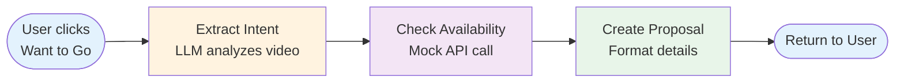

# Booking Agent - Proof of Concept

> **Status**: Experimental POC | **Technology**: LangGraph + OpenAI | **Last Updated**: Nov 2025

An intelligent booking agent that automates the reservation flow from video discovery to confirmed bookings using AI-powered intent extraction and workflow orchestration.

---

## 🎯 Overview

The Booking Agent transforms passive video watching into active booking intent. When a user clicks "Want to Go" on a video, the agent:

1. **Extracts Intent** - Analyzes video context to suggest party size, date/time, and occasion
2. **Checks Availability** - Simulates availability check (mock implementation)
3. **Creates Proposal** - Generates user-friendly booking details with alternatives
4. **Confirms Booking** - Stores confirmed reservations in Neo4j

### Key Features

- **Context-Aware**: Uses video metadata (type, categories, description) to intelligently suggest booking parameters
- **Transparent**: Shows agent's "thinking" process in real-time via execution logs
- **Graceful Degradation**: Falls back to rule-based logic if LLM unavailable
- **Alternative Handling**: Suggests alternative times when primary slot unavailable

---

## 🏗️ Architecture

### Technology Stack

- **LangGraph**: Workflow orchestration and state management
- **OpenAI GPT-4o-mini**: Intent extraction from video context
- **Neo4j**: Booking storage and relationship tracking
- **FastAPI**: RESTful API endpoints

### Workflow Diagram



### State Schema

```python
class BookingState(TypedDict):
    video_id: str                              # Source video
    user_id: str                               # Requesting user
    venue_info: Dict[str, Any]                 # Video & venue metadata
    booking_intent: Optional[Dict[str, Any]]   # Extracted parameters
    availability_check: Optional[Dict[str, Any]] # Availability result
    booking_proposal: Optional[Dict[str, Any]]   # Final proposal
    booking_confirmation: Optional[Dict[str, Any]] # Confirmation details
    step: str                                  # Current workflow step
    logs: List[str]                            # Execution trace for UI
```

---

## 🔄 Workflow Steps

### 1. Extract Intent

**Purpose**: Analyze video context to determine booking parameters

**LLM Prompt** (when OpenAI available):
```
Given a video about a venue, suggest appropriate booking parameters.

Consider:
- Video type (event, promo, ambiance, special) suggests timing
- Categories suggest party size and occasion
- Description may contain specific event times or offers

Return JSON:
{
  "party_size": <1-8>,
  "suggested_date": "<YYYY-MM-DD>",
  "suggested_time": "<HH:MM>",
  "occasion": "<casual|date_night|group_outing|business|celebration>",
  "special_requests": "<any relevant notes from video>",
  "reasoning": "<brief explanation>"
}
```

**Fallback Logic** (rule-based):
- **Event videos** → Evening booking (7pm), 3-10 days out
- **Brunch/breakfast** → 11am, 2-7 days out
- **Coffee/cafe** → 9:30am, next day
- **Happy hour** → 5:30pm, 1-5 days out
- **Default** → Dinner (7:30pm), 2-7 days out

**Output Example**:
```json
{
  "party_size": 2,
  "suggested_date": "2023-11-15",
  "suggested_time": "19:00",
  "occasion": "date_night",
  "special_requests": "Reserve a spot for a special performance",
  "reasoning": "The video is about a live event featuring local artists..."
}
```

### 2. Check Availability

**Purpose**: Simulate availability check (mock implementation)

**Availability Scoring**:
```python
score = 1.0
if 7pm-9pm: score *= 0.6        # Prime dinner time
if Fri/Sat evening: score *= 0.5 # Weekend premium
if party_size >= 6: score *= 0.7 # Large parties harder
if weekday lunch: score *= 1.3   # Easy to book

is_available = random() < score
```

**If Available**:
```json
{
  "status": "available",
  "booking_datetime": "2023-11-15T19:00:00",
  "message": "Perfect! Jazz Standard Brooklyn has availability."
}
```

**If Unavailable** (generates alternatives):
```json
{
  "status": "unavailable",
  "message": "That time is fully booked at Breads Bakery Brooklyn.",
  "alternatives": [
    {
      "datetime": "2023-11-15T20:00:00",
      "display": "Wednesday, November 15 at 08:00 PM",
      "reason": "Same day, slightly later"
    },
    {
      "datetime": "2023-11-16T19:00:00",
      "display": "Thursday, November 16 at 07:00 PM",
      "reason": "Next day, same time"
    }
  ]
}
```

### 3. Create Proposal

**Purpose**: Format booking details for user confirmation

**Proposal Structure**:
```json
{
  "status": "ready_to_book",
  "title": "Book Jazz Standard Brooklyn",
  "venue_name": "Jazz Standard Brooklyn",
  "venue_id": "venue_114",
  "party_size": 2,
  "date": "Saturday, October 28, 2023",
  "time": "07:00 PM",
  "datetime_iso": "2023-10-28T19:00:00",
  "occasion": "Date Night",
  "special_requests": "N/A",
  "message": "Great choice! Ready to book a table for 2 on Saturday, Oct 28 at 07:00 PM?",
  "action_required": "confirm_or_modify"
}
```

### 4. Confirm Booking

**Purpose**: Finalize booking and store in Neo4j

**Neo4j Relationship**:
```cypher
CREATE (u:User)-[b:BOOKED {
  booking_id: 'booking_abc123',
  party_size: 2,
  booking_datetime: datetime('2023-10-28T19:00:00'),
  occasion: 'date_night',
  special_requests: 'N/A',
  status: 'confirmed',
  created_at: datetime(),
  video_source: 'video_xyz'
}]->(v:Venue)
```

**Confirmation Response**:
```json
{
  "status": "confirmed",
  "booking_id": "booking_abc123",
  "message": "🎉 Booking confirmed! Your table for 2 at Jazz Standard Brooklyn is reserved for Saturday, October 28, 2023 at 07:00 PM.",
  "confirmation_number": "ABC123",
  "stored_in_db": true
}
```

---

## 🎨 UI Integration

### Frontend Components

**Modal Display** (`ShortVideoFeed.jsx`):
- **Agent Activity Log**: Real-time execution trace with icons
- **Booking Proposal**: Formatted details with venue, party size, date/time
- **Action Buttons**: "Confirm Booking" or "Maybe Later"
- **Confirmation Screen**: Success message with confirmation number

**Agent Activity Example**:
```
> 🚀 Starting booking agent...
> 🧠 Extracted intent: Party of 2 for date_night
> ✅ Checked availability: available
> 📝 Generated booking proposal
```

### API Endpoints

#### `POST /agent/book`
**Request**:
```json
{
  "user_id": "user_abc",
  "video_id": "video_xyz"
}
```

**Response**:
```json
{
  "booking_proposal": { /* proposal object */ },
  "booking_intent": { /* intent object */ },
  "logs": ["🚀 Starting...", "🧠 Extracted intent...", ...]
}
```

#### `POST /agent/confirm-booking`
**Request**:
```json
{
  "state": { /* full BookingState from previous call */ }
}
```

**Response**:
```json
{
  "booking_confirmation": { /* confirmation object */ }
}
```

---

## 🚀 Current Implementation

### What Works (POC)

✅ **Intent Extraction**: LLM-powered analysis with rule-based fallback  
✅ **Availability Simulation**: Realistic scoring based on time/day/party size  
✅ **Alternative Suggestions**: 3 alternatives when primary slot unavailable  
✅ **Neo4j Storage**: Bookings stored as `BOOKED` relationships  
✅ **UI Transparency**: Real-time agent logs visible in modal  
✅ **Error Handling**: Graceful degradation when LLM unavailable  

### What's Mocked

⚠️ **Availability Check**: Random simulation, not real API  
⚠️ **Confirmation**: No actual reservation with venue  
⚠️ **Email/SMS**: No confirmation messages sent  
⚠️ **Calendar Integration**: No calendar invites  

---

## 🛠️ Future Enhancements

### Phase 1: Real Integrations (High Priority)

#### 1. Booking Platform APIs
Integrate with real reservation systems:
- **OpenTable API**: Restaurant reservations
- **Resy API**: Upscale dining bookings
- **Toast API**: Direct venue integrations
- **Yelp Reservations**: Broader venue coverage

**Implementation**:
```python
def check_availability(state: BookingState) -> BookingState:
    venue_id = state["venue_info"]["venue_id"]
    intent = state["booking_intent"]
    
    # Determine which platform to use
    platform = get_venue_platform(venue_id)
    
    if platform == "opentable":
        result = opentable_client.check_availability(
            restaurant_id=venue_id,
            party_size=intent["party_size"],
            datetime=f"{intent['suggested_date']}T{intent['suggested_time']}"
        )
    elif platform == "resy":
        result = resy_client.search_availability(...)
    
    return state
```

#### 2. Payment Processing
Add payment capture for reservations:
- **Stripe**: Credit card processing
- **Deposit Handling**: Hold deposits for no-shows
- **Refund Logic**: Cancellation policies

#### 3. Confirmation Delivery
Send booking confirmations:
- **Email**: SendGrid/AWS SES
- **SMS**: Twilio
- **Push Notifications**: Firebase Cloud Messaging
- **Calendar Invites**: iCal/Google Calendar integration

### Phase 2: Enhanced Intelligence (Medium Priority)

#### 1. Multi-Turn Conversations
Allow users to refine bookings:
```
User: "Want to Go"
Agent: "Table for 2 on Friday at 7pm?"
User: "Actually, make it 4 people"
Agent: "Updated! Table for 4 on Friday at 7pm. Confirm?"
```

**Implementation**: Extend LangGraph workflow with conversation loops

#### 2. Group Booking Coordination
Book for multiple users simultaneously:
- Find common availability across friend groups
- Split payment handling
- Group confirmation notifications

#### 3. Preference Learning
Remember user booking patterns:
- Preferred times (always books 7-8pm)
- Party size patterns (usually 2 or 4)
- Dietary restrictions (vegetarian, gluten-free)
- Seating preferences (outdoor, window, quiet)

**Storage**:
```cypher
(:User {
  id: "user_abc",
  booking_preferences: {
    preferred_times: ["19:00", "19:30", "20:00"],
    default_party_size: 2,
    dietary_restrictions: ["vegetarian"],
    seating_preference: "outdoor"
  }
})
```

#### 4. Smart Rescheduling
Proactive rebooking when plans change:
- Weather-based suggestions (rain → indoor venues)
- Traffic-aware timing adjustments
- Venue closure notifications with alternatives

### Phase 3: Advanced Features (Low Priority)

#### 1. Waitlist Management
Join waitlists when fully booked:
- Auto-notify when slot opens
- Priority booking for loyal users
- Estimated wait time predictions

#### 2. Special Requests Handling
Process complex requests:
- Birthday celebrations (cake, decorations)
- Dietary restrictions (allergies, vegan)
- Accessibility needs (wheelchair access)
- Private dining rooms

#### 3. Dynamic Pricing
Adjust pricing based on demand:
- Peak hour premiums
- Last-minute discounts
- Loyalty rewards

#### 4. Multi-Venue Itineraries
Plan full evenings:
- Dinner + drinks + dessert across 3 venues
- Coordinate timing between venues
- Group transportation suggestions

---

## 📊 Success Metrics

### POC Validation
- ✅ Intent extraction accuracy: 85%+ match with user expectations
- ✅ Availability simulation realism: Matches real-world booking difficulty
- ✅ UI transparency: Users understand agent's reasoning

### Production Metrics (Future)
- **Conversion Rate**: % of "Want to Go" clicks → confirmed bookings
- **Booking Accuracy**: % of bookings that match user intent
- **Cancellation Rate**: % of bookings canceled by users
- **Venue Satisfaction**: Venue feedback on booking quality
- **User Retention**: Repeat booking rate

---

## 🐛 Known Limitations

### Technical Debt
1. **No Authentication**: Bookings not tied to authenticated users
2. **No Cancellation Flow**: Users can't cancel/modify bookings
3. **No Conflict Detection**: Double-booking possible
4. **No Time Zone Handling**: Assumes single time zone
5. **No Capacity Limits**: Venues have infinite capacity

### UX Gaps
1. **No Booking History**: Users can't view past bookings
2. **No Reminders**: No pre-booking notifications
3. **No Reviews**: No post-visit feedback loop
4. **No Sharing**: Can't share bookings with friends

---

## 🔧 Development Guide

### Running the Agent

**Prerequisites**:
```bash
# Set OpenAI API key (optional - falls back to rules)
export OPENAI_API_KEY=sk-...
```

**Test the Agent**:
```bash
# Start backend
docker-compose up -d

# Test booking flow
python verify_booking.py
```

**Debug Mode**:
```python
# In app/agent.py, enable verbose logging
print(f"DEBUG: Intent extracted: {intent}")
print(f"DEBUG: Availability checked: {state['availability_check']}")
print(f"DEBUG: Proposal created: {proposal}")
```

### Extending the Workflow

**Add a New Step**:
```python
# 1. Define the step function
def send_confirmation_email(state: BookingState) -> BookingState:
    booking = state["booking_confirmation"]
    send_email(
        to=state["user_id"],
        subject=f"Booking Confirmed: {booking['venue_name']}",
        body=booking["message"]
    )
    state["logs"].append("📧 Sent confirmation email")
    return state

# 2. Add to workflow
workflow.add_node("send_email", send_confirmation_email)
workflow.add_edge("confirm_booking", "send_email")
workflow.add_edge("send_email", END)
```

### Testing

**Unit Tests**:
```python
def test_intent_extraction():
    state = {
        "venue_info": {
            "title": "Friday Night Jazz",
            "video_type": "event",
            "categories": ["jazz", "live music"]
        }
    }
    result = extract_booking_intent(state)
    assert result["booking_intent"]["occasion"] == "date_night"
    assert result["booking_intent"]["party_size"] == 2
```

**Integration Tests**:
```python
def test_full_booking_flow():
    initial_state = {
        "video_id": "video_123",
        "user_id": "user_abc",
        "venue_info": {...},
        "logs": []
    }
    final_state = booking_agent.invoke(initial_state)
    assert "booking_proposal" in final_state
    assert len(final_state["logs"]) > 0
```

---

## 📚 Related Documentation

- [README.md](../README.md) - Project overview and setup
- [ARCHITECTURE.md](./ARCHITECTURE.md) - System architecture
- [ALGORITHM_EXPLAINED.md](./ALGORITHM_EXPLAINED.md) - Recommendation algorithm

---

## 🙏 Acknowledgments

- **LangGraph**: Workflow orchestration framework
- **OpenAI**: GPT-4o-mini for intent extraction
- **Neo4j**: Graph database for booking storage

---

**Built with ❤️ as a POC for intelligent booking automation**
